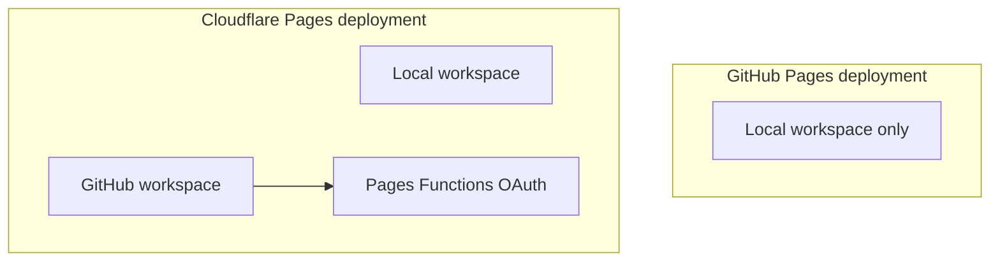
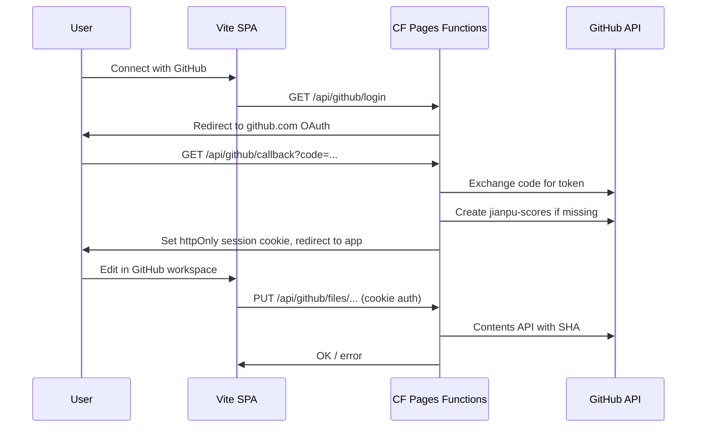

# Cloudflare Pages + GitHub Sync Plan

## Your decisions (locked in)

| Topic | Choice |
|-------|--------|
| Hosting | Keep GitHub Pages **and** add Cloudflare Pages (CI deploys both) |
| Storage | Private repo, **auto-created** as `jianpu-scores` on first connect |
| Audience | Any visitor can Connect with GitHub |
| Workspaces | **Local** and **GitHub** are separate tab sets (not cache-of-each-other) |
| Conflicts | Last write wins |

**Gist limits (why repo won):** 10 MB/file, 300 files/gist, API inline cap 1 MB. Fine for small scores, but repo is the right long-term fit for one-tab-per-file.

---

## Hard constraint: sync only works on Cloudflare

GitHub Pages is static — it cannot run OAuth token exchange. Cookies set on `*.pages.dev` are **not** sent to `*.github.io`.



- **Cloudflare URL:** full app — Local + GitHub workspaces, Connect button, autosave
- **GitHub Pages URL:** Local workspace only; small banner linking to the Cloudflare URL for sync

Same frontend codebase; gate GitHub features with `import.meta.env.VITE_ENABLE_GITHUB_SYNC` (true on Cloudflare build, false on GitHub Pages build).

---

## Architecture



### Repo layout (per user, private `jianpu-scores`)

```
jianpu-scores/
  .jianpu/manifest.json   # active, fileIds, bin metadata (not user-facing tabs)
  scores/foo.jianpu
  scores/bar.jianpu
  bin/baz.jianpu          # deleted files
```

- One `.jianpu` per tab (matches your tab model)
- `manifest.json` preserves stable `fileIds` (needed for `web/src/partToggleCache.ts`) and active file across renames
- Last-write-wins: each save fetches latest SHA, then overwrites content

### Session cookie (not PAT in browser)

Pages Functions hold `GITHUB_CLIENT_SECRET` and store the user access token in an **httpOnly, Secure, SameSite=Lax** encrypted session cookie. Frontend never sees the token — safer than paste-a-PAT.

---

## Cloudflare Pages Functions (new)

Add under `web/functions/`:

| Route | Purpose |
|-------|---------|
| `GET /api/github/login` | Start OAuth (PKCE + state cookie) |
| `GET /api/github/callback` | Exchange code, auto-create repo, set session |
| `POST /api/github/logout` | Clear session |
| `GET /api/github/session` | `{ connected, username, repo }` for UI |
| `GET /api/github/store` | Load manifest + file list |
| `GET /api/github/files/:path` | Read one `.jianpu` |
| `PUT /api/github/files/:path` | Write one file (debounced from client) |
| `PATCH /api/github/manifest` | Update active/rename/delete/bin ops |

Reference pattern: [customkeymap `functions/`](https://github.com/Kit-314/customkeymap/tree/main/functions) (OAuth + GitHub proxy, minimal scope).

**Secrets** (Cloudflare dashboard, not in git): `GITHUB_CLIENT_ID`, `GITHUB_CLIENT_SECRET`, `SESSION_SECRET`.

**OAuth App callback URLs to register:**

- `https://<your-project>.pages.dev/api/github/callback`
- `http://localhost:8788/api/github/callback` (wrangler dev)

---

## Frontend changes

### 1. Dual workspace model

Refactor around existing `web/src/fileStore.ts` — same `FileStoreState` shape, two backends:

| Workspace | Persistence | Hook |
|-----------|-------------|------|
| Local | `localStorage` key `jianpu:files:v1` (unchanged) | `useLocalFileStore()` (rename of current `useFileStore`) |
| GitHub | Repo via `/api/github/*` | `useGitHubFileStore()` |

`web/src/App.tsx` gets:

- Workspace switcher (Local | GitHub) above `web/src/components/FileList.tsx`
- When GitHub + not connected → Connect prompt instead of tabs
- When GitHub + connected → normal tabs, backed by repo

### 2. Autosave (GitHub workspace only)

New `useGitHubAutosave(store, connected)`:

- Debounce ~1.5s after store changes (same order of magnitude as worker debounce in `web/src/hooks/useJianpuWorker.ts`)
- Dirty-file tracking: only push changed paths
- Status UI: idle / saving / saved / error
- On workspace switch-in: full pull from repo

### 3. New components

- `GitHubConnectButton` — triggers `/api/github/login`
- `WorkspaceSwitcher` — Local vs GitHub
- `SyncStatusIndicator` — saving state in GitHub workspace

### 4. Part toggles

Keep part toggle cache local-only per workspace (`jianpu:part-toggles:v1` keyed by `fileId`) — no need to sync toggles to GitHub in v1.

---

## CI / dual deploy

### Keep existing GitHub Pages workflow

`.github/workflows/pages.yml` — add build env:

```yaml
env:
  VITE_BASE_PATH: /jianpu-generator/
  VITE_ENABLE_GITHUB_SYNC: 'false'
```

### New Cloudflare Pages workflow

Add `.github/workflows/cloudflare-pages.yml`:

- Same build steps (Rust wasm + `pnpm build` in `web/`)
- `VITE_BASE_PATH: /` (root on `*.pages.dev`)
- `VITE_ENABLE_GITHUB_SYNC: 'true'`
- Deploy with `cloudflare/wrangler-action` using `CLOUDFLARE_API_TOKEN` + `CLOUDFLARE_ACCOUNT_ID` repo secrets (create once in Cloudflare dashboard — no credit card)

Add `web/wrangler.toml`:

```toml
name = "jianpu-generator"
pages_build_output_dir = "dist"
```

Functions auto-discovered from `web/functions/`.

---

## Manual setup checklist (you do once)

1. Create free Cloudflare account (email only)
2. Create GitHub OAuth App (public client, repo scope for private repos)
3. Add repo secrets: `CLOUDFLARE_API_TOKEN`, `CLOUDFLARE_ACCOUNT_ID`, plus CF dashboard secrets for OAuth
4. Optional: custom domain on Cloudflare later

---

## Testing

- Unit tests for manifest ↔ `FileStoreState` mapping
- Playwright: mock `/api/github/*` routes — connect flow, autosave debounce, workspace isolation (Local tabs unchanged when switching)
- Manual: `wrangler pages dev` against built `dist`

---

## Out of scope (v1)

- Sync on GitHub Pages origin (impossible without cross-origin cookie hacks)
- Conflict UI (last-write-wins only)
- Migrating Local files → GitHub (can add "Copy to GitHub" later)
- GitHub App / installation-per-repo (OAuth App is simpler for "anyone connects")

---

## Risk callouts

1. **Two URLs forever** — users must use Cloudflare URL for sync; document this in app UI
2. **OAuth App rate limits** — fine for personal/small public use; monitor if traffic grows
3. **Repo name collision** — if user already has `jianpu-scores`, reuse it (don't fail)
4. **Build time** — dual CI runs wasm build twice per push; acceptable for now, can cache wasm artifact later

---

## Implementation checklist

- [ ] Add `web/wrangler.toml`, `web/functions/` OAuth routes (login/callback/logout/session), and `cloudflare-pages.yml` workflow
- [ ] Implement Pages Functions for repo auto-create, manifest CRUD, and per-file read/write with SHA last-write-wins
- [ ] Split `useFileStore` into Local vs GitHub backends; add `WorkspaceSwitcher` and gate with `VITE_ENABLE_GITHUB_SYNC`
- [ ] Add `useGitHubAutosave` debounce hook, Connect button, sync status indicator
- [ ] Wire `VITE_BASE_PATH` and `VITE_ENABLE_GITHUB_SYNC` into both CI workflows; add GitHub Pages sync-disabled banner
- [ ] Add manifest mapping unit tests and Playwright mocks for GitHub workspace flows
